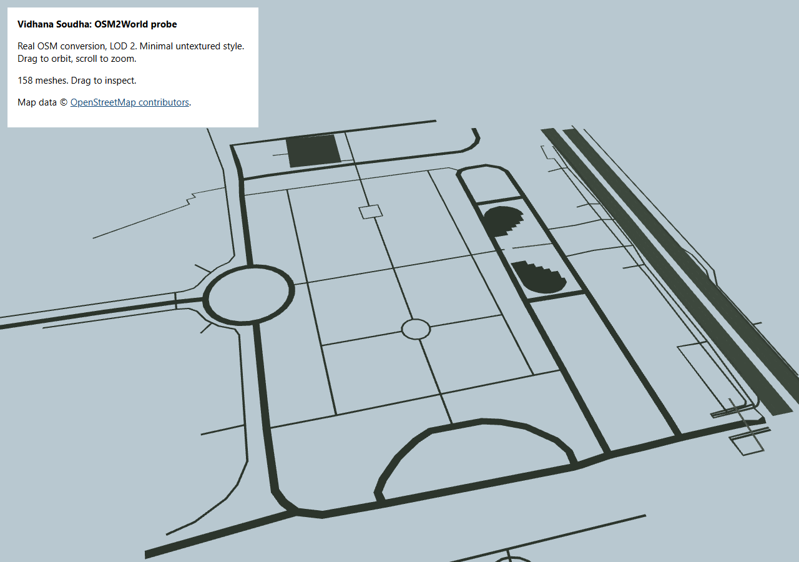

# OSM2World street patch probe

Status: successful isolated conversion, 2026-09-10. No app integration or deployment.

## Result

Converted existing `vidhana-streets.osm` with official OSM2World web build `0.5.0-SNAPSHOT_2026-02-18`. Output is real converter geometry, not a hand-drawn approximation. Final sample includes highway-tagged ways and their referenced nodes only. Buildings, lawns, relations and unrelated point objects are excluded.

| Measure | Result |
|---|---:|
| Input ways / nodes | 67 / 340 |
| Meshes | 158 |
| Vertices / triangles | 6,357 / 2,119 |
| GLB file | 366,400 bytes |
| Geometry JSON / gzip | 510,675 / 51,547 bytes |
| Conversion | 662.5 ms, one local Edge run |
| Import + config + conversion | 1,052.2 ms, same run |
| Converter warnings | 0 |
| Three.js GLTFLoader errors | 0 |

Files under `experiments/osm2world/`: `vidhana-sample.glb`, `preview.html`, `preview.png`, `sample-input.json`, `sample-meshes.json`, `results.json`, and reproducible scripts.



## Scope and quality

Selection center: longitude 77.5908, latitude 12.9798. Ways qualify when at least one node falls within 180 m. Selected geometry retains immediately adjacent endpoints to preserve road continuity. Therefore this is not a precise circular clip. Input bounds are longitude 77.5887867 to 77.5926451 and latitude 12.9778248 to 12.9817644. Geometry covers approximately 423 by 439 m.

Minimal configuration uses LOD 2 and no downloaded texture pack. Geometry includes connected roadway and footway surfaces and small raised details, with heights from 0 to 0.10 m. It does not prove photorealism, accurate curb heights, lane markings, full sidewalks, or measured road widths. OSM tags and converter defaults govern these features. Preview shows a useful street network baseline, not a finished visual upgrade. No ground plane or buildings are included.

158 separate meshes could mean about 158 draw calls in a naive integration. Batch compatible materials before mobile use. Precompute GLB during asset preparation instead of shipping the 3,884,381-byte converter to every player. Existing road layer and this geometry must not both cover the same road footprint.

## Georeferencing

Explicitly configured `MetricMapProjection`. OSM2World chooses the center of input node bounds when explicit bounds are absent. Projection origin is **[77.5907159, 12.9797946]**, about 9 m west of the selection center. Do not anchor this GLB at the selection center.

Native geometry coordinates: X east, Y height, Z north, in local meters. GLB exporter preserves these coordinates. For MapLibre normalized Mercator coordinates, let `origin = MercatorCoordinate.fromLngLat([77.5907159, 12.9797946], 0)` and `s = origin.meterInMercatorCoordinateUnits()`:

```
mapX = origin.x + meshX * s
mapY = origin.y - meshZ * s
mapZ = origin.z + meshY * s
```

Apply the equivalent matrix in the existing Three custom layer; do not add a second arbitrary 90-degree rotation afterward. Terrain elevation, winding/culling and z-fighting still need integration checks. Exact alignment on the live MapLibre view has not been tested.

Source audit confirms converter chooses `osmData.getCenter()`, node bounds determine that center, and `MetricMapProjection` uses locally scaled Mercator snapped to millimeters. Audit files downloaded under `D:/CodexTools/OSM2World/`; current upstream sources were read to corroborate behavior, with explicit projection set to avoid depending on changing defaults.

## Reproduce

Tools/downloads reside at `D:/CodexTools/OSM2World/`, no package installation. Node and bundled Playwright use existing installations. From repository root:

```powershell
& 'C:/Program Files/nodejs/node.exe' experiments/osm2world/probe.cjs
& 'C:/Program Files/nodejs/node.exe' experiments/osm2world/export-glb.cjs
& 'C:/Program Files/nodejs/node.exe' experiments/osm2world/verify-preview.cjs
```

Probe starts temporary localhost port 4188. Preview verifier uses 4189 and locally cached Three.js 0.169.0 modules, then closes browser and server. `preview.html` uses official package CDN URLs when opened through a regular static server. Browser verification loaded the GLB, checked 158 scene children and captured `preview.png` with no page errors.

## Sources and licensing

- [Official web library documentation](https://osm2world.org/docs/library-web/): callback API, LOD controls, geometry/material accessors. Its default hosted style is for initial experiments; production style resources should be self-hosted.
- [Official pinned web module](https://osm2world.org/build/web/0.5.0-SNAPSHOT_2026-02-18/osm2world-core-web.mjs): used in this probe.
- [Official upstream license](https://github.com/tordanik/OSM2World/blob/master/LICENSE.txt): MIT, copyright 2010-2026 OSM2World contributors, verified 2026-09-10. Retain copyright and permission notice with redistributed software. Local copy in tool cache. This check covers current upstream license; no separately signed license manifest accompanies the downloaded snapshot.
- [OpenStreetMap copyright and ODbL](https://www.openstreetmap.org/copyright): input XML declares ODbL and OpenStreetMap contributors attribution. Preview and GLB asset metadata include attribution. Keep source-data attribution and applicable ODbL obligations with any released derived data.
- No third-party texture pack was copied or redistributed. Its asset licenses would require separate checking before use.

Confidence: high for successful conversion, measured artifacts and geometry load; moderate for production usefulness until map alignment and mobile batching are tested.
