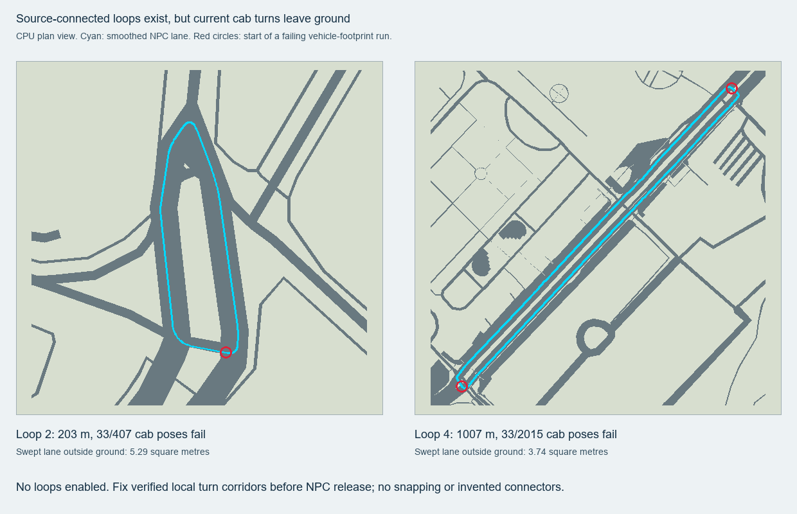

# First 500 m: no cab loop ready for release

CPU audit of the isolated391-segment public motor graph, with exact OSM source-node connectivity. No runtime files, production networks or rendered assets were changed. Confidence high for the geometry failures under the tested current lane/turn rules.

## Result

Five meaningful closed legal-turn loops exist after conservative filtering. **None passes the cab ground-corridor check.** This does not establish that no future geometry-aware route could fit these roads. It establishes that current NPC lane offsets and quadratic turns cannot safely be released on these loops without further work.

| Loop | Smoothed length | Source edges | Failing cab poses | Lane corridor outside ground |
|---|---:|---:|---:|---:|
| 0 | 567 m | 27 | 831 / 1,134 | 227.95 m² |
| 1 | 537 m | 28 | 844 / 1,075 | 228.54 m² |
| 2 | 203 m | 9 | 33 / 407 | 5.29 m² |
| 3 | 174 m | 10 | 45 / 348 | 5.88 m² |
| 4 | 1,007 m | 28 | 33 / 2,015 | 3.74 m² |

Loop length can exceed500m while remaining entirely inside the500m study circle.

## Graph rules and completeness

The input has391source segments. Exclusions, applied sequentially, are22segments ending at unsupported boundary portals,97narrow carriageway segments, and known defective way52057928 segment0. Remaining directed states number316.

- Node joins use exact original OSM node IDs, never coordinate rounding or proximity.
- `oneway=yes/-1/no` is preserved. Restricted access, conditional access and non-ground-level motor routes were already excluded by the isolated generator.
- Unsupported boundary portals are withheld, not connected to neighboring vectors.
- Two-way width below4.8m and one-way width below3m are withheld, matching current NPC policy. Estimated widths are not relabeled as surveyed widths.
- Immediate reverse travel is forbidden. Source heading changes of135degrees or more are forbidden. Cycles require at least three source edges and100m source length.
- Enumeration finds every simple directed-state cycle in the retained components. Its safety cap was not reached:678DFS visits, five cycles. Composite repeated traversals do not supply an invented connector.

Before width filtering there are three cyclic components of68,42and32directed states. After filtering there are two, of32and30states. Narrow bidirectional service streets account for most removed potential loops.

## Vehicle and surface test

The candidate is the final classified/scaled ground footprint with SHA256`03676f34203016d70b73f7f883d72e8c6897b171e21c28af7cc6035589a7284d`.

Paths use the current NPC left-side offset rule and quadratic turns, including the7m/30%-of-edge trims and24curve subdivisions. Coordinates are evaluated in the same exact MapLibre local frame as candidate ground. The cab envelope is4.6m long and1.9m wide, with0.1m extra lateral margin on either side, sampled every at most0.5m. A continuous2.1m-wide corridor must also remain on ground. Only2mm is allowed for numerical seams.

Every sampled full vehicle rectangle is compared with ground, so a centerline that fits while its wheels/body leave the surface still fails. These tests are conservative ground containment checks, not suspension simulation or a claim of exact wheel mesh coordinates. Ground includes pavement; even a pass would still need asphalt/kerb semantic checks, vehicle turning-radius checks and traffic interaction validation.

## Concrete next repair targets

Loop4, approximately1km, is closest to usable by total outside corridor area. Its failures are confined to two corner runs:

- Near `[77.59075845,12.97772014]`, nearest way991536562 segment5.
- Near `[77.59378910,12.98098632]`, nearest way1276833545 segment0.

Loop2, approximately203m, has one failing corner run near `[77.58867966,12.98096726]`, nearest way358318638 segment0. Its component uses ways338941361,358318638and763048421. Loop3 adds a second failure near way1092049622 segment2.

For the next bounded iteration, inspect those exact junction polygons and construct turn curves constrained by verified drivable geometry and the complete cab envelope. Existing source connectivity supplies the legal turns, so no external connector needs inventing. If a feasible corridor does not fit inside verified asphalt, keep that turn disabled rather than widening into a sidewalk. Re-run this audit after any local curve or ground repair. Do not enable the five current loops merely because their centerlines form cycles.

Loops0and1have extensive ground failures, particularly along the western service-road path around way38542543 and way1368389075. They should not be the first release targets.

## Verification and artifacts

`street-500-loop-audit.py` passes seven deterministic fixture checks: a wide legal square, reversed one-way rejection, nearby unrelated node isolation, boundary withholding, known-gap withholding, narrow two-way rejection and immediate-reverse rejection. The wide fixture also demonstrates a contained smooth corridor, so the audit is not constructed to reject every path.

`street-500-loop-audit.json` records each loop, failure run, nearest original source segment, measurements and input hashes. `street-500-loop-preview.geojson` records exact sampled paths for inspection. `street-500-loop-clearance.png` is a CPU-generated plan view, not a screenshot from the game. No GPU or network was used. No NPC loop was enabled.
