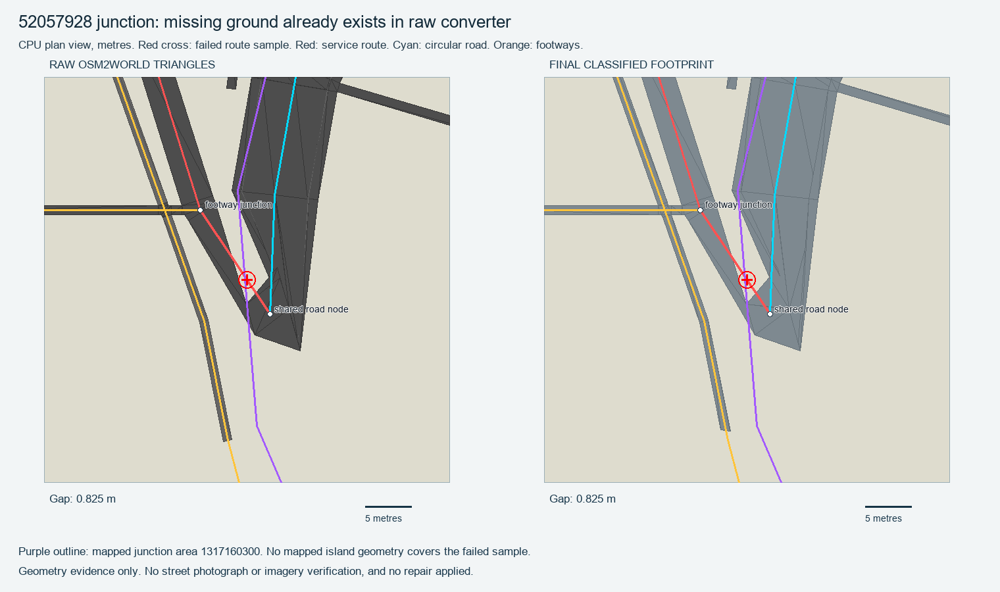

# Ringwood junction gap: bounded investigation

The gap is already present in the raw OSM2World meshes. It was not introduced by final clipping, material deduplication or ground eligibility filtering. Confidence: high for geometry evidence; moderate for converter join interpretation; unknown for current real-world kerb/island arrangement.

`street-500-route-junction.py` creates the image and JSON entirely on CPU. Red is the original service-road source segment; cyan is the circular-road centerline; orange is mapped footway geometry. The red probe visibly crosses the empty acute-angle gap in both original and final surfaces.

## Source geometry

- Probe: `[77.59020226666667, 12.975491600004656]`.
- Service road `52057928` runs from shared circular-road node `428831252` to footway junction node `663564863` along original segment0. Both original refs are present. Tags explicitly permit motor vehicles and make this road one-way.
- Circular road `1091198031` joins at node `428831252`, has two lanes, asphalt and both sidewalks. It has a conditional motor-access schedule, so unrestricted NPC routing is not valid.
- Footway `52059625` joins the service road at node `663564863`. Sidewalk `1370351127` runs on its west side. The supplied nodes do not identify a zebra crossing at these joins. No crossing stripes should be inferred here.
- Mapped `junction=yes, area=yes` way `1317160300` contains the probe. Its tag describes a junction area, not a drivable polygon with surveyed kerb edges.
- The separately mapped garden island `38318887` (Cubbon Park Circle / Ringwood Circle) is about10.7m from the probe and does not contain it. The broad Cubbon Park outline contains the probe; that does not make the road an island.

## Measurements

In the exact MapLibre local frame, raw gap is **0.825366m** and final gap **0.825364m**. The earlier route audit uses111320m/degree local physical distance and reports0.826292m; this small reporting-frame difference does not change the failure.

Raw versus final ground differs by only **0.000384m² within10m of the probe**, consistent with export precision. The larger44m square includes the500m clip boundary, which legitimately removes geometry at its southern edge.

The straight first source segment has **4.675m uncovered** by raw ground. Its endpoints each have ground, but their connecting surface fails a clearance test after a **0.5m inward buffer**. A1m inward buffer also disconnects them. Thus a2m-wide car cannot be routed around the hole within the existing local asphalt by a harmless smooth-centerline adjustment. Nearest-point snapping would hide an invalid corridor.

Nearest raw source mesh is323, triangle1, asphalt-colored. Neighboring triangles from source meshes78,80,1074 and1075 establish the acute junction edges. These are immutable snapshot indices, not inferred OSM identities.

## Safe next action

Withhold this first service-road segment from NPC entry until the junction has a verified passable envelope. Do not delete the visible road or force a U-turn. Keep any traffic loop using this connection unavailable. No runtime exclusion was applied by this audit.

For a repair, first obtain road-level/aerial reference for this exact Ringwood junction and verify road widths and island/kerb footprint. Then build the local shared-node junction envelope from its incident road cross-sections, preserving the mapped sidewalks and confirmed island. Subtract existing ground and add only the missing verified asphalt region, with matching height and material. Recompute ground footprint and route corridor from the same repaired geometry. Test the widest supported vehicle through the whole turn, retaining at least its half-width of clearance, plus one-way and crossing behavior.

If reference confirms a real island blocking the straight source centerline, route geometry must follow a verified curve around that island. If source/converter cross-section trim is defective, repair the converter junction fill itself. Available OSM tags and geometry favor a converter acute-join defect, but do not justify inventing the real kerb layout.

## Isolated scene companion

`qc/street-500-scene-data/vidhana-street-data.json` was regenerated against the corrected classified footprint, with matching isolated road-network JSON. It retains21explicit zebra locations,165individual stripe polygons,54mapped crossings,7signals and22memorial points. Production files were not overwritten. The new motor graph remains isolated from runtime pending its independent integration checks.
