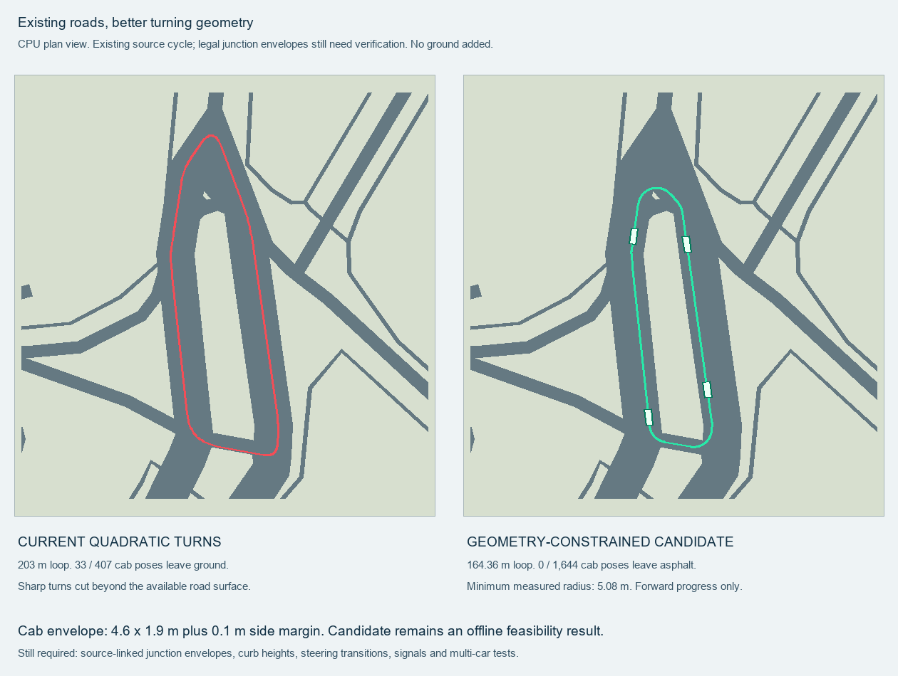

# A ground-contained cab turn candidate exists

The bounded CPU search found a physically plausible **geometric candidate**, not a release-ready NPC loop. It fits the existing exported asphalt with a full4.6m-by1.9m cab plus0.1m lateral margin. No road geometry was added. The prior loop audit remains unchanged.

## Verified geometry result

The selected candidate is164.3557m long, derived from the existing loop2, which uses source ways338941361,763048421and358318638. It follows the original forward traversal direction around the same island. Its path was generated by rounding an offset of the existing enclosed island envelope, then making a bounded0.5m west /0.7m north adjustment entirely inside existing ground.

- Designed corner radius:5.1m. Minimum radius measured on the tessellated path: **5.0832m**.
- Cab envelope:4.6m length,2.1m width including side margins.
- Dense validation: **1,644full-body poses at at most0.1m spacing**, zero poses outside ground or final asphalt/marking triangles.
- Swept union of sampled body rectangles outside ground: **0m²**.
- Swept union outside final asphalt/marking triangles: **0m²**.
- Continuous lateral corridor outside ground: **0m²**.
- Progress projected onto the original ordered source cycle: no backward steps larger than1cm and no reversal.
- At3m/s (10.8km/h), the minimum measured radius implies approximately1.77m/s² lateral acceleration. This is a low-speed geometry feasibility assumption, not a verified Cybercab steering specification.

The asphalt check decodes the final classified GLB, accepting only actual `asphalt` and `marking` material batches at road height. It does not use the broad ground union alone, and does not accept concrete pavement as asphalt. Only2mm numeric seam tolerance is applied.

## Still unverified: source junction ownership

**Ninety of the1,644poses extend beyond the constant-width source ribbons**, even though they remain on existing exported asphalt. Those ribbons use estimated widths and do not describe the complete widened junction envelope. The north turnaround moves within that wider asphalt area instead of visiting each centerline vertex literally.

Therefore this candidate proves that a full car can physically fit a smooth closed curve on the existing geometry. It does **not** yet prove that every part of that curve is the correct legal movement through the mapped junction. The source-ID route order is retained and no outside road connection is created, but integration must assign the widened turn area to the correct incident source ways and verify that the earlier turnaround does not cross an island, prohibited turn, stop line or conflicting lane.

Do not resolve this by widening the estimated ribbons until the test passes. Use the actual reviewed junction polygon and source incident-road identity. If that area cannot be verified for this turn, keep the candidate disabled. The original source-only audit's rejection remains valid for the current runtime path.

## Search scope and rejected options

226bounded shape trials were evaluated across the two most promising existing cycles, loop2 and loop4. Families were island-envelope offsets, rolling-disk corner rounding and sub-metre rigid adjustments. The search changes path geometry only.

A170.08m path with3m radius passed its lateral corridor but failed16full-body poses. It was rejected. Several nominal5m-radius paths had radius measured just below5m after tessellation; a5.1m construction was used for the final candidate instead. Larger whole-loop offsets generally pushed long straight sections off available asphalt. No passing candidate was found for the approximately1km loop4 within these bounded families. This is not proof that loop4 is impossible.

## Safe next integration step

1. Review the exact widened junction envelope against source road identities and references. Keep the known unrelated52057928 defect and unsupported boundary portals withheld.
2. Express this path as a route bound to those verified source edges and junction polygons. Preserve progress/direction and signal/stop associations; do not replace general navigation with a hardcoded arbitrary oval.
3. Apply steering-rate transitions and vehicle dynamics at low speed. Check measured turning radius, actual wheel contacts and height changes. The current evidence is dense CPU sampling, not a continuous-time dynamics proof.
4. Test a small NPC group for collision spacing, queue release and player takeover, then perform street-level and helicopter visual checks plus performance measurements.

No runtime adoption, traffic enablement, GPU work, production regeneration or deployment occurred during this task.

## Reproducible artifacts

- `qc/street-500-turn-search.py`: bounded search and dense checks. It loads only pure helper definitions from the prior audit without executing or rewriting that audit.
- `qc/street-500-turn-search.json`: trial results and final dense measurements.
- `qc/street-500-turn-candidate.geojson`: selected geometric route, explicitly an offline candidate.
- `qc/street-500-turn-preview.py` and `.png`: CPU-generated before/after visual.

Input ground SHA256: `03676f34203016d70b73f7f883d72e8c6897b171e21c28af7cc6035589a7284d`. Confidence high for measured geometric containment and unchanged production state; moderate for physical feasibility under the stated low-speed assumption; legal junction qualification remains unverified.
